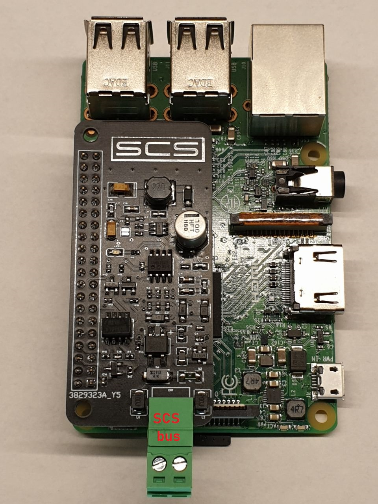

# SCS BTicino Bridge - Home Assistant Add-on

<p align="center">
  
</p>

Integrazione nativa per il bus SCS BTicino in Home Assistant OS, progettata per Raspberry Pi 5 (compatibile anche con Pi 3/4).

## 🎯 Caratteristiche principali

- **Integrazione nativa Home Assistant**: MQTT Discovery automatica per tutti i dispositivi
- **Isolamento galvanico completo**: Shield hardware che protegge il Raspberry dal bus SCS
- **Web UI integrata**: Interfaccia web per configurazione e test dispositivi (porta 80)
- **Supporto dispositivi completo**:
  - Luci on/off e dimmer
  - Serrande e tapparelle motorizzate
  - Sensori di temperatura
  - Termostati
  - Gruppi
  - Serrature elettriche
  - Campanelli e pulsanti
- **Comunicazione MQTT**: Protocollo standard per massima compatibilità
- **API REST**: Endpoint JSON per integrazioni personalizzate
- **Monitoraggio real-time**: Lettura e scrittura bidirezionale dal/sul bus

## 🔧 Hardware richiesto

### Shield SCS-Raspberry-pi
Shield hardware dedicato che si collega ai GPIO del Raspberry Pi e comunica con il bus BTicino SCS.

**Specifiche tecniche:**
- **Isolamento galvanico**: Completo tra Raspberry e bus SCS
- **Alimentazione**: Tramite bus SCS (non richiede alimentazione aggiuntiva per il bus)
- **Connessioni GPIO utilizzate**:
  - UART0 TX (pin 8)
  - UART0 RX (pin 10)
  - GPIO 12 (pin 32) - Controllo opto-isolatore
- **Compatibilità**: Raspberry Pi 3/4/5

**Dove acquistare:**
- [Sito ufficiale SCS Shield](https://scsshields.altervista.org/)
- [Pagina contatti](http://scsshields.altervista.org/contatti.html)

### Requisiti Raspberry Pi

| Modello | Supporto | Note |
|---------|----------|------|
| Raspberry Pi 5 | ✅ Completo | Consigliato, supporto libgpiod nativo |
| Raspberry Pi 4 | ✅ Completo | Testato e funzionante |
| Raspberry Pi 3 | ✅ Completo | Richiede disabilitazione Bluetooth* |

> **Nota Raspberry Pi 3**: È necessario disabilitare il Bluetooth per liberare l'UART0. Seguire [questa guida](https://di-marco.net/blog/it/2020-04-18-tips-disabling_bluetooth_on_raspberry_pi/).

## 📦 Installazione

### 1. Preparazione Hardware
1. Spegnere il Raspberry Pi
2. Montare la shield SCS sui GPIO
3. Collegare la shield al bus BTicino (2 fili)
4. Riaccendere il Raspberry

### 2. Installazione Add-on
1. Aprire Home Assistant
2. Andare in **Impostazioni** → **Add-on** → **Store**
3. Cliccare sui tre puntini in alto a destra → **Repository**
4. Aggiungere l'URL del repository
5. Installare **SCS BTicino Bridge**
6. Avviare l'add-on

### 3. Configurazione

```yaml
mqtt_host: "core-mosquitto"  # Broker MQTT (default: broker HA)
mqtt_port: 1883
mqtt_user: ""                # Opzionale
mqtt_password: ""            # Opzionale
serial_port: "/dev/serial0"  # Porta seriale (default per RPi)
debug_mode: false            # Abilita debug remoto (porta 5678)
log_level: "INFO"           # DEBUG|INFO|WARNING|ERROR
```

**Note configurazione:**
- Se si usa il broker MQTT di Home Assistant, lasciare `mqtt_host: "core-mosquitto"`
- La porta seriale `/dev/serial0` è corretta per Raspberry Pi con UART0 abilitato
- Il `debug_mode` abilita il debugger remoto Python sulla porta 5678 (solo per sviluppo)

## 🚀 Primo utilizzo

### 1. Configurazione dispositivi
Aprire l'interfaccia web dell'add-on:
```
http://homeassistant.local
```
oppure tramite **Home Assistant** → **Configurazione add-on** → **Apri interfaccia web**

### 2. Aggiungere dispositivi
1. Cliccare su **Configurazione**
2. **Aggiungi nuovo dispositivo**
3. Compilare i campi:
   - **Nome**: Nome identificativo (es. "Luce Salotto")
   - **Tipo**: Selezionare il tipo di dispositivo
   - **Indirizzo A** (Ambiente): Numero da 0-15
   - **Indirizzo PL** (Punto Luce): Numero da 0-15
   - Per **tapparelle**: specificare anche i tempi di salita/discesa in millisecondi

### 3. Trovare gli indirizzi SCS
Gli indirizzi sono configurati nei dispositivi BTicino:

**Metodo 1 - Da configuratore BTicino:**
- Consultare la configurazione originale dell'impianto
- Gli indirizzi sono visibili nel software di configurazione

**Metodo 2 - Test manuale:**
- Usare la funzione **Test** nell'interfaccia web
- Provare combinazioni di indirizzi A/PL fino a trovare il dispositivo

**Metodo 3 - Monitor bus:**
- Premere fisicamente un pulsante BTicino
- Osservare i messaggi nella sezione **Monitor Bus** dell'interfaccia web
- Annotare l'indirizzo che appare quando si preme il pulsante

### 4. Discovery automatica
Una volta configurati, i dispositivi appariranno **automaticamente** in Home Assistant grazie a MQTT Discovery:
- **Configurazione** → **Dispositivi e servizi** → **MQTT**
- Cercare "SCS BTicino Bridge"

## 📡 Integrazione Home Assistant

### Entity automatiche
Ogni dispositivo configurato genera automaticamente le entity corrette:

| Tipo dispositivo | Domain HA | Entity |
|------------------|-----------|--------|
| on_off | `switch` | `switch.nome_dispositivo` |
| dimmer | `light` | `light.nome_dispositivo` |
| serrande_tapparelle | `cover` | `cover.nome_dispositivo` |
| sensori_temperatura | `sensor` | `sensor.nome_dispositivo` |
| termostati | `climate` | `climate.nome_dispositivo` |
| campanello_porta | `binary_sensor` | `binary_sensor.nome_dispositivo` |
| serrature | `lock` | `lock.nome_dispositivo` |
| gruppi | `switch` | `switch.nome_dispositivo` |

### Esempio automazione

```yaml
automation:
  - alias: "Accendi luce salotto al tramonto"
    trigger:
      - platform: sun
        event: sunset
    action:
      - service: switch.turn_on
        target:
          entity_id: switch.luce_salotto
```

### Controllo tapparelle con posizione

```yaml
service: cover.set_cover_position
target:
  entity_id: cover.tapparella_camera
data:
  position: 50  # 0=chiusa, 100=aperta
```

## 🔍 Topic MQTT

L'add-on utilizza topic MQTT strutturati per ogni dispositivo:

### Struttura base
```
/scsshield/device/{slug}/status          # Stato dispositivo
/scsshield/device/{slug}/switch          # Comando on/off
/scsshield/ReceivefromBus               # Monitor messaggi bus
/scsshield/SendtoBus                    # Invio comandi raw
```

### Esempi per tipo dispositivo

**Switch/Dimmer:**
```
/scsshield/device/luce_salotto/status              → "on"/"off"
/scsshield/device/luce_salotto/switch              ← "on"/"off"/"toggle"
/scsshield/device/luce_salotto/dimmer              ← "0-100"
/scsshield/device/luce_salotto/status/percentuale  → "75"
```

**Tapparella:**
```
/scsshield/device/tapparella_camera/status       → "0-100" (posizione)
/scsshield/device/tapparella_camera/percentuale  ← "0-100"
```

**Sensore temperatura:**
```
/scsshield/device/temperatura_soggiorno/status   → "22.5"
/scsshield/device/temperatura_soggiorno/request  ← "1" (forza lettura)
```

**Termostato:**
```
/scsshield/device/termostato_sala/temperatura_termostato_impostata  → "21.5"
/scsshield/device/termostato_sala/modalita_termostato_impostata     → "INVERNO"
/scsshield/device/termostato_sala/set_temp_termostato               ← "22.0"
/scsshield/device/termostato_sala/set_modalita_termostato           ← "INVERNO"/"ESTATE"/"OFF"
```

## 🛠️ Funzionalità avanzate

### Comandi RAW sul bus
Inviare comandi diretti al bus SCS via MQTT:

```bash
# Formato: A8 [byte1] [byte2] [byte3] [byte4] [checksum] A3
mosquitto_pub -t /scsshield/SendtoBus -m "A8 01 00 12 00 13 A3"
```

### Monitor messaggi bus
Sottoscrivere al topic per monitorare tutti i messaggi:

```bash
mosquitto_sub -t /scsshield/ReceivefromBus
```

### API REST
L'add-on espone API REST sulla porta 80:

```bash
# Lista dispositivi configurati
curl http://homeassistant.local/GetConfigurazionereact.json

# Health check
curl http://homeassistant.local/health

# Configurazione MQTT
curl http://homeassistant.local/mqtt_config.json
```

### Endpoint diagnostici

**Health check:**
```bash
GET /health
```
Risposta:
```json
{
  "status": "ok",
  "mqtt": {
    "connected": true,
    "host": "core-mosquitto",
    "port": "1883"
  },
  "serial": {
    "port": "/dev/serial0",
    "configured": true
  },
  "devices": {
    "count": 15,
    "types": {
      "on_off": 8,
      "dimmer": 3,
      "serrande_tapparelle": 4
    }
  }
}
```

## 🐛 Troubleshooting

### L'add-on non si avvia
1. **Verificare i log**: Impostazioni add-on → Log
2. **Controllare la porta seriale**:
   ```bash
   ls -la /dev/serial*
   ls -la /dev/ttyAMA*
   ```
3. **Raspberry Pi 3**: Assicurarsi che il Bluetooth sia disabilitato

### Dispositivi non rispondono
1. **Verificare gli indirizzi A e PL**: Devono corrispondere alla configurazione BTicino
2. **Controllare il monitor bus**: Vedere se arrivano messaggi quando si preme fisicamente un pulsante
3. **Testare dalla web UI**: Usare la funzione Test per ogni dispositivo

### GPIO12 non funziona (Raspberry Pi 5)
L'add-on tenta automaticamente questi metodi:
1. libgpiod (preferito su RPi 5)
2. sysfs GPIO (fallback)

Se vedi `⚠ Running without GPIO control`:
1. Verificare che `gpio: true` sia nel config.yaml dell'add-on
2. Controllare i permessi device in `config.yaml`:
   ```yaml
   devices:
     - "/dev/gpiochip0:/dev/gpiochip0:rwm"
     - "/dev/gpiochip4:/dev/gpiochip4:rwm"
   ```

### MQTT non si connette
1. **Verificare che il broker MQTT sia installato**: Add-on Store → Mosquitto broker
2. **Controllare le credenziali**: Se il broker richiede autenticazione, configurare `mqtt_user` e `mqtt_password`
3. **Testare la connessione**:
   ```bash
   mosquitto_sub -h core-mosquitto -p 1883 -t test
   ```

### Discovery non funziona
1. **Verificare integrazione MQTT in HA**: Configurazione → Integrazioni → MQTT
2. **Riavviare l'add-on**: Forza la ripubblicazione discovery
3. **Controllare i topic**:
   ```bash
   mosquitto_sub -h core-mosquitto -t "homeassistant/#" -v
   ```

## 📚 Documentazione tecnica

### Compatibilità dispositivi BTicino
- Serie MyHOME (bus SCS)
- Attuatori standard (F411, F411/2, F411/4)
- Dimmer (F418)
- Termostati e cronotermostati
- Sensori di temperatura
- Serrature elettriche
- Interfacce videocitofonia

### Protocollo SCS
- Baudrate: 9600 bps
- Formato trama: 7 o 11 byte
- Start byte: 0xA8
- Stop byte: 0xA3
- Checksum: XOR di tutti i byte dati

### Architettura software
```
┌─────────────────────────────────────┐
│     Home Assistant Core             │
│  (MQTT Integration + Entities)      │
└──────────────┬──────────────────────┘
               │ MQTT Discovery
               │
┌──────────────▼──────────────────────┐
│      Mosquitto MQTT Broker          │
└──────────────┬──────────────────────┘
               │ MQTT Pub/Sub
               │
┌──────────────▼──────────────────────┐
│   SCS BTicino Bridge Add-on         │
│                                     │
│  ┌─────────────────────────────┐   │
│  │  Tornado Web Server (80)    │   │
│  └─────────────────────────────┘   │
│                                     │
│  ┌─────────────────────────────┐   │
│  │  MQTT Client (gmqtt)        │   │
│  └─────────────────────────────┘   │
│                                     │
│  ┌─────────────────────────────┐   │
│  │  SCS Protocol Handler       │   │
│  └─────────────────────────────┘   │
│                                     │
│  ┌─────────────────────────────┐   │
│  │  Serial Handler (asyncio)   │   │
│  └──────────┬──────────────────┘   │
└─────────────┼──────────────────────┘
              │ UART
              │
┌─────────────▼──────────────────────┐
│     SCS Shield (Opto-isolated)     │
└─────────────┬──────────────────────┘
              │ Bus SCS
              │
┌─────────────▼──────────────────────┐
│   BTicino SCS Bus / Devices        │
└────────────────────────────────────┘
```

## 🔐 Sicurezza

- Isolamento galvanico completo via hardware
- Nessuna esposizione diretta del Raspberry al bus SCS
- Comunicazione MQTT con supporto autenticazione
- Permessi limitati ai soli device necessari
- Logs dettagliati per audit

## 🤝 Supporto e Community

- **Sito ufficiale**: [https://scsshields.altervista.org/](https://scsshields.altervista.org/)
- **Contatti**: [http://scsshields.altervista.org/contatti.html](http://scsshields.altervista.org/contatti.html)
- **Documentazione completa**: Disponibile sul sito ufficiale

## 📝 Changelog

### v1.0.9.22
- ✅ Supporto completo Raspberry Pi 5 (libgpiod)
- ✅ MQTT Discovery automatica per Home Assistant
- ✅ Gestione robusta dimmer (comandi numerici e testuali)
- ✅ Slug-based topic MQTT (caratteri speciali sanitizzati)
- ✅ Health check endpoint (`/health`)
- ✅ Pubblicazione discovery all'avvio
- ✅ Logging strutturato con livelli configurabili
- ✅ Debug remoto opzionale (debugpy)

## 📄 Licenza

Questo progetto è distribuito per uso personale. Per uso commerciale, contattare l'autore tramite il sito ufficiale.

---

**Developed with ❤️ for Home Assistant community**
